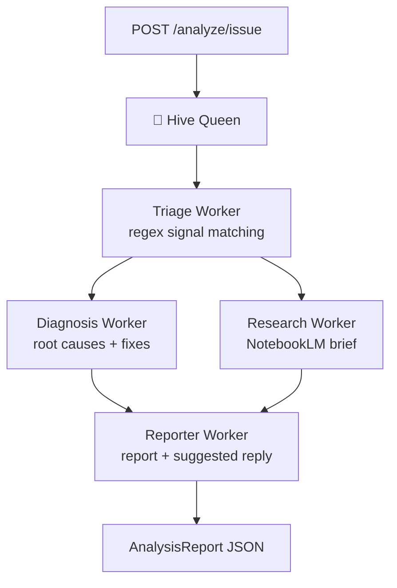

# 🐝 FastAPI Issue Hive

**A hive-mind multi-agent system that analyzes GitHub issues and diagnoses FastAPI connectivity problems — free, open source, and fully functional without any API key.**

[](https://github.com/wac0ku/fastapi-issue-hive/actions)


Paste an issue (or point it at a public repo) and the hive tells you: *is this a connectivity problem, what's the root cause, how do you fix it* — plus a ready-to-post reply and a NotebookLM-ready research brief.

```bash
curl -X POST localhost:8000/analyze/issue \
  -H "Content-Type: application/json" \
  -d '{"title": "502 Bad Gateway with nginx in front of uvicorn", "body": "..."}'
```

## Why

FastAPI is one of the most-starred Python web frameworks, and its issue trackers and forums are dominated by a recurring set of **connectivity problems**: CORS misconfiguration, reverse-proxy 502/504s, Docker networking, blocked event loops, WebSocket drops. The same ten root causes get re-diagnosed by hand thousands of times. This project automates that triage. See [docs/research/niche-analysis.md](docs/research/niche-analysis.md) for the research behind the niche.

## Architecture — Hive Queen orchestration

A **Queen** agent orchestrates specialized **worker** agents per analysis (one Queen, many specialized workers):



- **Triage** — deterministic classification against a curated knowledge base of 9 connectivity failure modes (always free, no API calls)
- **Diagnosis + Research** — run **concurrently** via `asyncio.gather`; both consume the triage result
- **Reporter** — assembles the final report and a ready-to-post GitHub reply
- **Claude enhancement (optional)** — with `ANTHROPIC_API_KEY` set, workers enrich their output with issue-specific analysis; without it, everything stays deterministic

## Quickstart

```bash
git clone https://github.com/wac0ku/fastapi-issue-hive.git
cd fastapi-issue-hive
poetry install

poetry run uvicorn app.main:app --reload
# → open http://localhost:8000/docs for the interactive API
```

No configuration needed. Optionally copy `.env.example` to `.env` to enable Claude enhancement (`ANTHROPIC_API_KEY`) or raise GitHub rate limits (`GITHUB_TOKEN`).

## API

| Endpoint | What it does |
|----------|--------------|
| `GET /health` | Status + active mode (`heuristic` / `claude-enhanced`) |
| `GET /categories` | The 9 connectivity failure modes the hive can diagnose |
| `POST /analyze/issue` | Full hive pipeline on a single issue (title + body) |
| `POST /analyze/repo` | Fetch open issues of a public GitHub repo and analyze each |

Example — scan a repository:

```bash
curl -X POST localhost:8000/analyze/repo \
  -H "Content-Type: application/json" \
  -d '{"owner": "fastapi", "repo": "fastapi", "limit": 5}'
```

## What the hive diagnoses

CORS / cross-origin · connection refused & binding · reverse proxy (nginx/Traefik/Cloudflare) · timeouts & hanging requests · WebSockets · SSL/HTTPS · Docker & container networking · event-loop blocking · streaming/SSE buffering

Each category ships with regex triage signals, known root causes, concrete fixes, and documentation links — see [`app/knowledge/connectivity.py`](app/knowledge/connectivity.py).

## NotebookLM research workflow

Every analysis produces a **research brief**: a dense, self-contained markdown document designed to be dropped into a [NotebookLM](https://notebooklm.google.com) notebook as a source — for audio overviews, FAQ generation, and deep-dive follow-up questions. See [docs/07-notebooklm-workflow.md](docs/07-notebooklm-workflow.md).

## Tests

```bash
poetry run pytest -v   # 12 tests, zero API keys required
```

CI runs the suite on Python 3.10 and 3.12 on every push.

## Docker

```bash
docker build -t fastapi-issue-hive .
docker run -p 8000:8000 fastapi-issue-hive
```

## Documentation

Full documentation lives in [`docs/`](docs/README.md):

| Chapter | Contents |
|---------|----------|
| [01 — Getting Started](docs/01-getting-started.md) | Install, first analysis, operating modes |
| [02 — Architecture](docs/02-architecture.md) | Hive Queen pattern, workers, design decisions |
| [03 — API Reference](docs/03-api-reference.md) | Endpoints, schemas, examples |
| [04 — Knowledge Base](docs/04-knowledge-base.md) | The 9 categories & how to add your own |
| [05 — Configuration](docs/05-configuration.md) | Env vars, modes, model selection |
| [06 — Deployment](docs/06-deployment.md) | Docker, nginx, free hosting |
| [07 — NotebookLM Workflow](docs/07-notebooklm-workflow.md) | Research briefs as NotebookLM sources |
| [08 — Troubleshooting](docs/08-troubleshooting.md) | Common problems & fixes |

Contributions welcome — see [CONTRIBUTING.md](CONTRIBUTING.md).

## Project layout

```
app/
├── main.py                  # FastAPI app + routes
├── config.py                # settings (all keys optional)
├── schemas.py               # Pydantic models
├── knowledge/connectivity.py# curated failure-mode knowledge base
├── services/                # GitHub API client, optional Claude wrapper
└── hive/
    ├── queen.py             # 🐝 orchestrator
    └── workers/             # triage, diagnosis, research, reporter
prompts/templates.json       # system prompts for Claude-enhanced mode
tests/                       # pytest suite (offline)
docs/                        # architecture, niche research, workflows
```

## License

[MIT](LICENSE) — free to use, fork, and build on.
