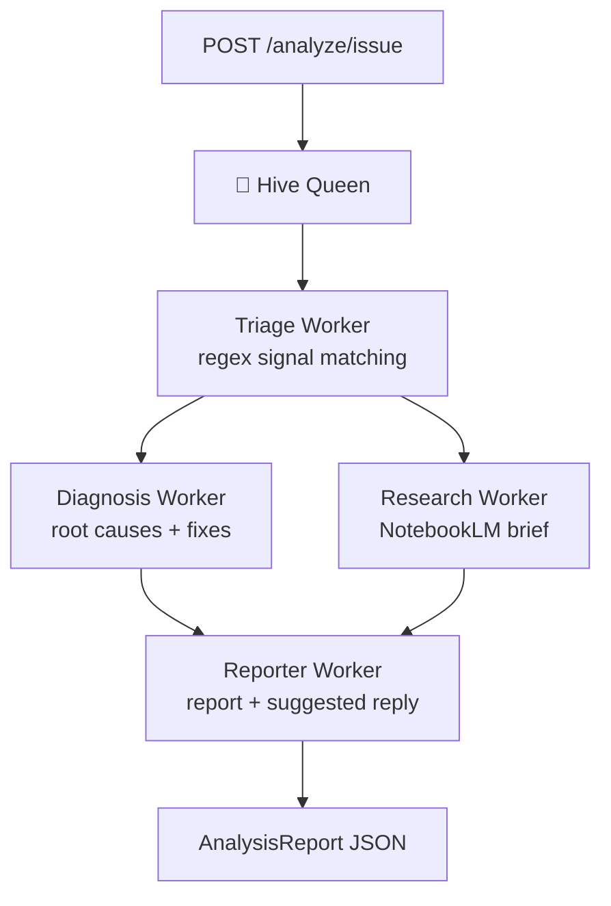

# 02 — Architecture

## The hive pattern

**One Queen, specialized workers, explicit data dependencies.**

The Queen (`app/hive/queen.py`) owns the pipeline. Workers never call each other — they receive inputs from the Queen and return typed results (Pydantic models in `app/schemas.py`). This keeps every worker independently testable and lets the Queen parallelize wherever the dependency graph allows.



| Worker | File | Input | Output | API calls |
|--------|------|-------|--------|-----------|
| Triage | `app/hive/workers/triage.py` | `IssueInput` | `TriageResult` | none, ever |
| Diagnosis | `app/hive/workers/diagnosis.py` | issue + triage | `Diagnosis` | optional Claude |
| Research | `app/hive/workers/research.py` | issue + triage | `ResearchBrief` | optional Claude |
| Reporter | `app/hive/workers/reporter.py` | issue + triage + diagnosis | suggested reply (str) | none |

**Concurrency:** diagnosis and research both depend only on the triage result, so the Queen runs them concurrently with `asyncio.gather`. Repository scans (`/analyze/repo`) additionally analyze all fetched issues concurrently.

## Request flow, end to end

1. `POST /analyze/issue` deserializes into `IssueInput` (title, body, optional URL and labels).
2. **Triage** lowercases title + body + labels and matches them against every category's regex signals. Matched signals are counted; title hits weigh double (the title names the actual problem). The score is normalized against the category's signal count. Below `MIN_CONFIDENCE` (0.15) the issue is declared out of scope.
3. **Diagnosis** merges root causes, fixes and doc links of the top-2 matched categories. In claude-enhanced mode it additionally asks Claude for 3–6 sentences of issue-specific analysis.
4. **Research** renders a self-contained markdown brief: original issue, triage verdict, background per matched category, doc links, suggested NotebookLM prompts — plus a Claude deep-dive section when available.
5. **Reporter** writes a ready-to-post GitHub reply. For out-of-scope issues it asks clarifying questions instead of guessing.
6. The Queen assembles everything into an `AnalysisReport`.

## Graceful degradation

Every Claude call goes through one funnel: `app/services/claude.py::ask_claude`. It returns `None` when

- no API key is configured, **or**
- the `anthropic` import fails, **or**
- the API call raises for any reason (network, rate limit, invalid key).

Workers treat `None` as "stay heuristic". Consequences:

- The demo, the test suite, and CI run 100% free and offline
- An Anthropic outage degrades answer *depth*, never availability
- The knowledge base is the single source of truth; Claude only adds issue-specific nuance on top

This is a deliberate design choice: **LLMs as an enhancement layer, not a dependency.**

## Module layout

```
app/
├── main.py                   # FastAPI app, 4 routes, error mapping
├── config.py                 # pydantic-settings; all fields optional
├── schemas.py                # every cross-worker data shape lives here
├── knowledge/
│   └── connectivity.py       # 9 ConnectivityCategory dataclasses
├── services/
│   ├── github.py             # async httpx client for the GitHub REST API
│   └── claude.py             # optional Anthropic wrapper (the None funnel)
└── hive/
    ├── queen.py              # orchestration only — no domain logic
    └── workers/              # domain logic only — no orchestration
```

Two rules keep the codebase navigable:

1. **The Queen orchestrates, workers decide.** `queen.py` contains no domain knowledge; workers contain no scheduling.
2. **Schemas are the contract.** Any data crossing a worker boundary is a Pydantic model in `schemas.py` — nothing passes as loose dicts.

## Extension points

- **New failure category** → one dataclass entry in `app/knowledge/connectivity.py` ([04 — Knowledge Base](04-knowledge-base.md)). Triage, diagnosis, research and `/categories` pick it up automatically.
- **New worker** → add a module under `app/hive/workers/`, give it a typed result in `schemas.py`, and wire it into the Queen's `asyncio.gather` stage that matches its dependencies.
- **New issue source** (GitLab, Jira, …) → implement a fetcher in `app/services/` that returns `list[IssueInput]`; the rest of the pipeline is source-agnostic.
